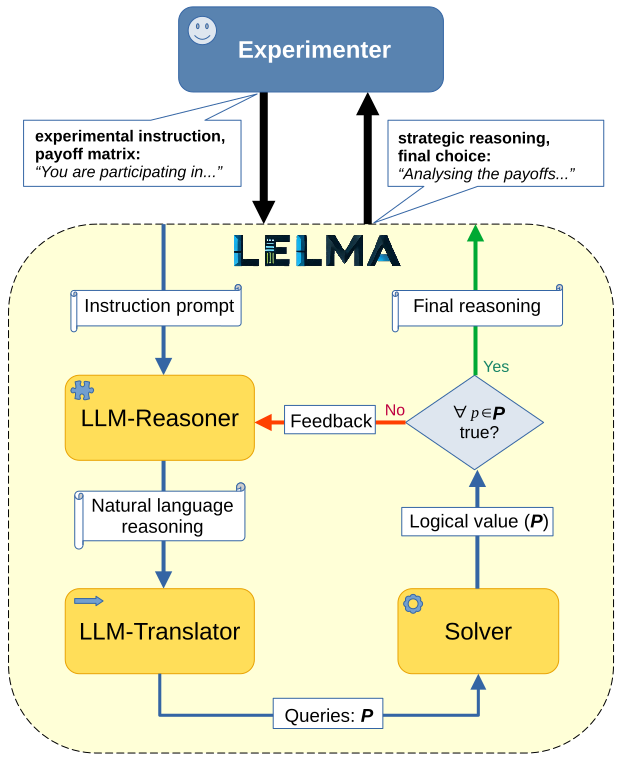

<div style="display: flex; justify-content: space-between; align-items: center;">


</div>

## LELMA Framework

LELMA is a framework for verifying and self-improving the correctness of the reasoning generated by LLMs, written in Python in Prolog. It was developed for reasoning in game-theoretical dilemmas, but thanks to modularity can be adapted to other domains.

## Overview

The framework consists of four main components:

- **Reasoner**: An LLM responsible for producing reasoning.
- **Translator**: An LLM that translates statements from the Reasoner's output into logical queries sent to the **Solver**.
- **Solver**: A normal logic program implemented in Prolog.
- **Feedback loop**: This mechanism provides feedback if any query evaluations fail. Each failed query is translated back to natural language and forwarded to the **Reasoner** using a feedback prompt.

The general overview of the architecture is shown below.

<p align="center">

</p>

## Usage

To run the sample experiment, use the following command in your terminal:

```bash
python experiment.py
```
You can modify the parameters of the experiment by modifying [full_experiment.ini](DATA/CONFIG/full_experiment.ini). To use GPT-4 and Gemini, used by default in the experiment, the respective API keys has to be stored in environment variables.  

## Project structure

The structure of the project is as follows:
```bash
.
├── DATA/
│   └── CONFIG/
│   └── TEMPLATES/
├── llms/
│   ├── gemini.py
│   ├── gpt4.py
├── src/
│   └── base/
│       ├── base_llm.py
│       ├── base_prompt_maker.py
│   ├── lelma.py
│   ├── prompt_maker.py
│   ├── setup_logger.py
│   ├── solver.py
├── experiment.py
└── solver.pl
```
[base](src/base) directory contains abstract classess that need to be implemented to adapt the framework for a specific use-case ([base_prompt_maker.py](src/base/base_prompt_maker.py)) and to use a specific LLM ([base_llm.py](src/base/base_llm.py)). [DATA](DATA) directory contains configuration data an the templates for prompts and predicates. 

## Adaptations

To adapt the framework for the use in other domains, the following steps are needed:

1. [Solver](solver.pl) needs to be replaced with a domain-specific solver.
2. [Templates](DATA/TEMPLATES) for instruction, translation, and feedback prompt have to be provided.
3. [Predicates.csv](DATA/TEMPLATES/predicates.csv) file for the domain has to be specified. This file serves as a basis for the translation from natural language and back. The columns are as follows:
   
| Column Name              | Description                                                                 |
|--------------------------|-----------------------------------------------------------------------------|
| **predicate**            | A Prolog predicate. |
| **regex**                | A regular expression pattern used to extract predicates' arguments.    |
| **long_desc**            | A detailed natural language explanation of the predicate.                  |
| **short_desc**           | A brief natural language explanation of the predicate.                         |
| **inverse_mapping**      | A regular expression for creating natural language feedback from failed queries as their negation. |
| **inverse_mapping_positive** | A regular expression for creating natural language feedback from failed queries by substituting correct values.  |

4. A class inheriting from [BasePromptMaker](src/base/base_prompt_maker.py) has to be implemented to handle creating prompts from the templates (see [PromptMaker](src/prompt_maker.py) as an example). Note that there are two alternative types of feedback based on failed queries: one providing the negation of failed queries (e.g. "10 is not the highest payoff for choice B") and one substituting the correct values to the failed queries (e.g. "35 is the highest payoff for choice B"). The latter turned out to be more effective in the experiments.

## Evaluation

TODO
